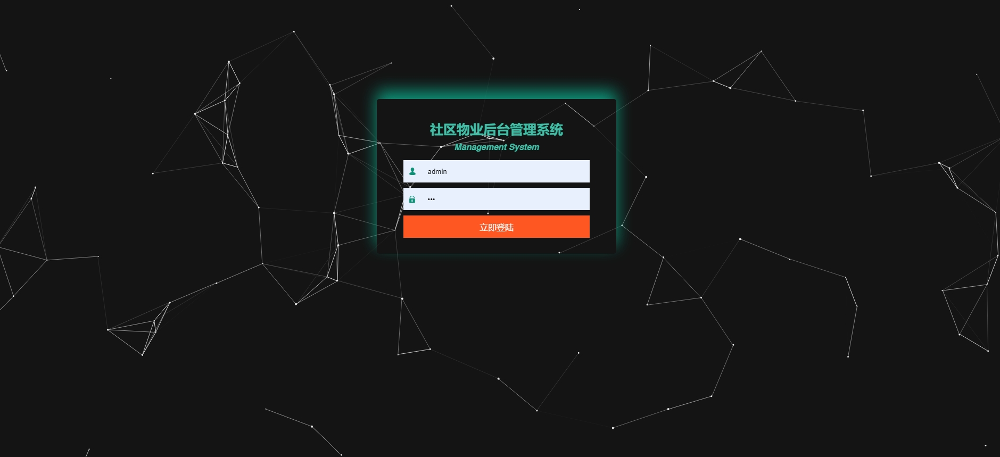
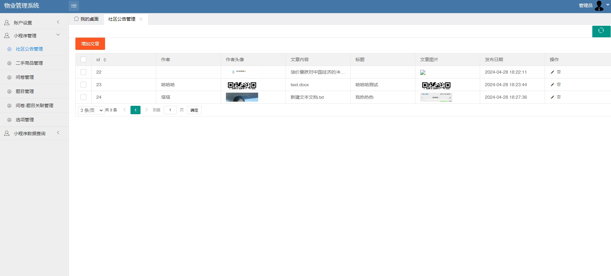
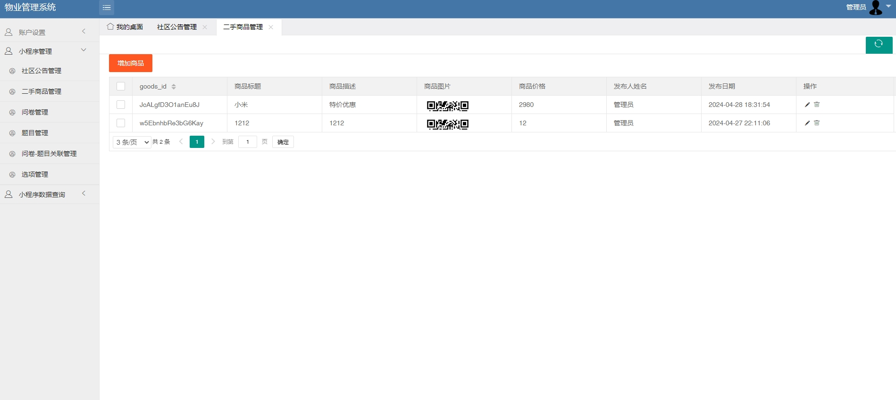
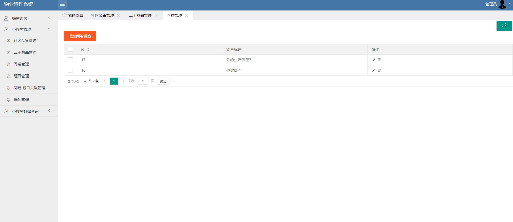
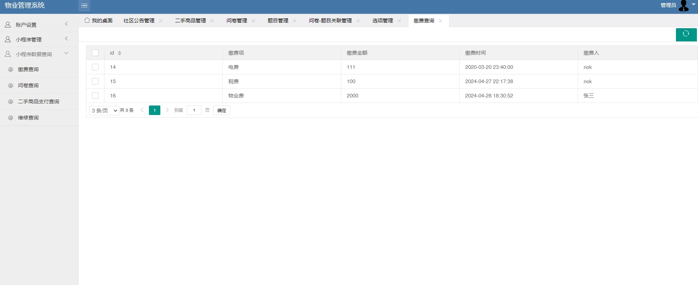
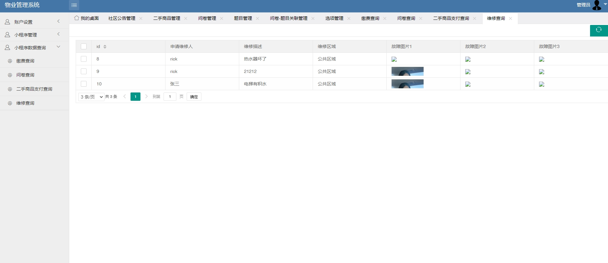
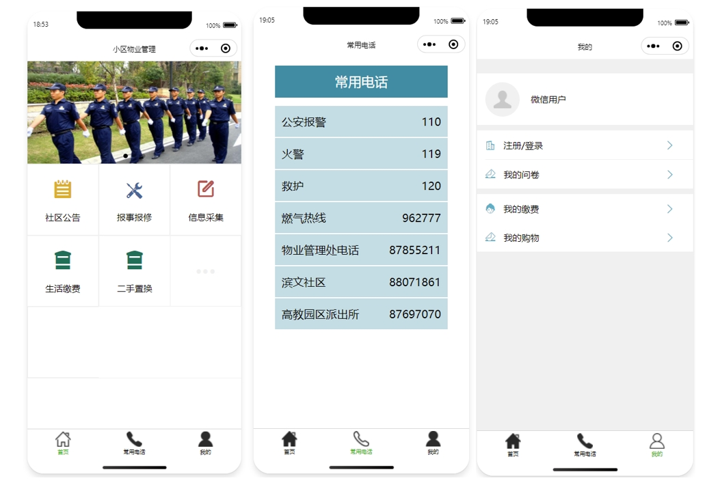
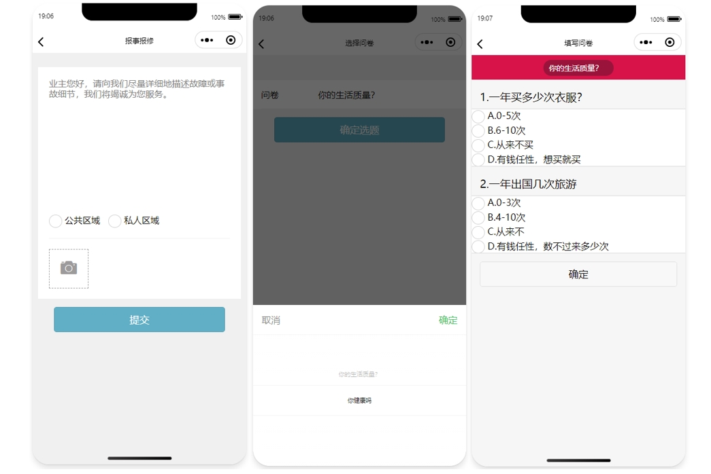
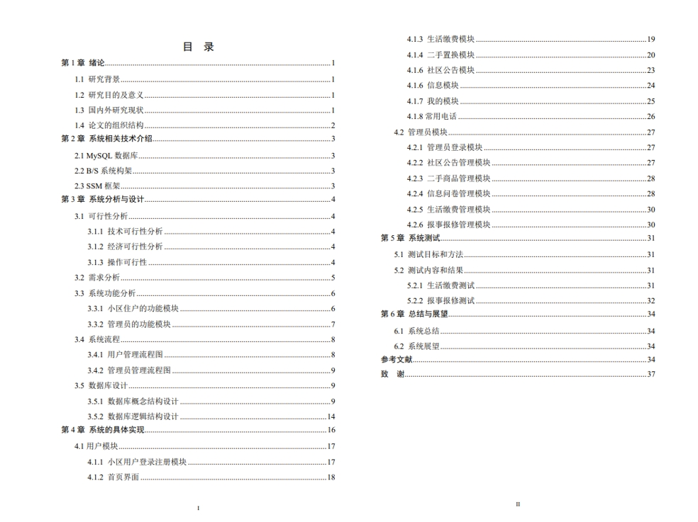

# 1.项目介绍
- 系统角色：管理员、业主（普通用户）
- 功能模块：管理员（用户管理、二手置换管理、报修管理、缴费管理、公告管理）、普通用户（登录注册、二手置换、生活缴费、信息采集、报事报修）
- 技术栈：SSM，layui，微信小程序
- 测试环境：idea2024，MySQL5.7，navicat，微信开发工具
# 2.项目部署
## 2.1后端部署
- 创建数据库，导入sql文件
- 通过idea打开后端程序SheQu，根据本地数据库环境修改src/main/resources/jdbc.properties  1-7行，特别重要，很关键。
- 配置tomcat，路径配置为/SheQu，可以自定义，前提是你会修改小程序的请求路径
- 后端管理web：本机IP:8080/SheQu/  管理员账号密码：admin/123
## 2.2 小程序部署
- 通过微信开发工具打开frogla
- appid配置为测试号appid
- 打开即可，登录账号密码查看user表
# 3.项目部分截图

# 4.获取方式
[戳我查看](https://gitee.com/aven999/mall)